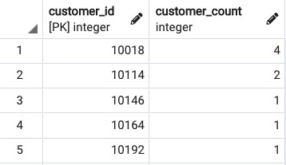
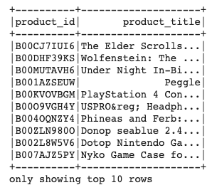
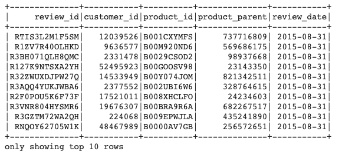
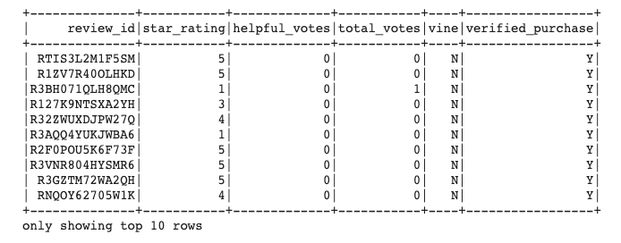

# Amazon_Vine_Analysis

## Overview of the analysis of the Vine program:

In this project we take a look at the Amazon Vine program and tried to determine if there was a bias toward more favorable reviews from Vine members.  In order to do perform this analysis, PySpark was used perform the ETL process by extracting the dataset from a url.  This data was then connected to an AWS RDS instance and loaded and pushed to pgAdmin for data storage and manipulation.  Once the tables were loaded, we downloaded the vine_table to explore the potential for bias in greater detail.  This Vine program analysis was done on video games but the structure of the data is the same so this process will work on any other Vine program.  

## Results:

Deliverable 1:

The goal of deliverable 1 was to create the AWS RDS database with tables in pgAdmin.  

Four tables were created: customers_table, products_table, review_id_table, and vine_table.  Please see a snap-shot of each table below. The customers_table snap-shot was taken from pgAdmin since I forgot to display the table in my ETL notebook. 

Deliverable 2:

How many Vine reviews and non-Vine reviews were there? 
1.	Vine Reviews: 102
2.	non-Vine Reviews: 64000

How many Vine reviews were 5 stars? 48

How many non-Vine reviews were 5 stars? 20,282

What percentage of Vine reviews were 5 stars? ~47%

What percentage of non-Vine reviews were 5 stars? ~32%

## Summary:

The summary states whether or not there is bias, and the results support this statement (2 pt)
An additional analysis is recommended to support the statement (2 pt)
